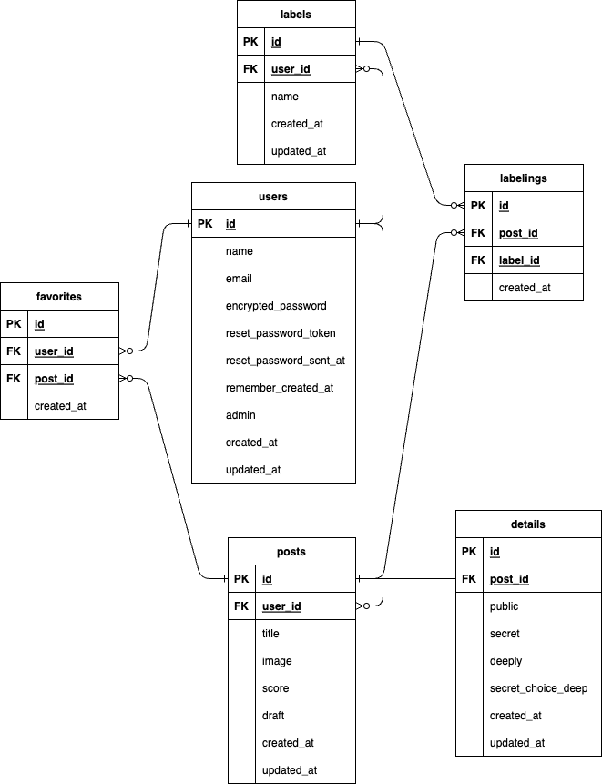

# 卒業課題
## 開発言語バージョン
 - rails 6.1.7
 - ruby 3.0.1

## 就業Termで学んだ技術
 - device
 - お気に入り機能

## カリキュラム外技術
 - cancancan
 - ransack

 ## アプリケーションの実行手順
  `rails _6.1.7_ new okiraku -d postgresql`  
  `cd okiraku`  
  `git init`  
  `git add .`  
  `git commit -m "railsファイルの作成"`  
  `git push git@github.com:rrkrgft/okiraku.git master`  
  `git checkout -b issues/#1`  
  `git branch`  
  `rails db:create`  
  `rails s`  

## カタログ設計、テーブル定義書、ワイヤーフレームの共有リンク
 [カタログ設計](https://1drv.ms/x/s!Agex3JiktMUAgfsfEyg6QBKEUm_aiw?e=1nv7fO)  
 [テーブル定義書](https://1drv.ms/x/s!Agex3JiktMUAgfsfEyg6QBKEUm_aiw?e=1nv7fO)  
 [ワイヤーフレーム](https://1drv.ms/b/s!Agex3JiktMUAgfsk7h43q-5tA0zjgw?e=h6Foh6)

##  ER図、、画面遷移図の画像
   
 
   